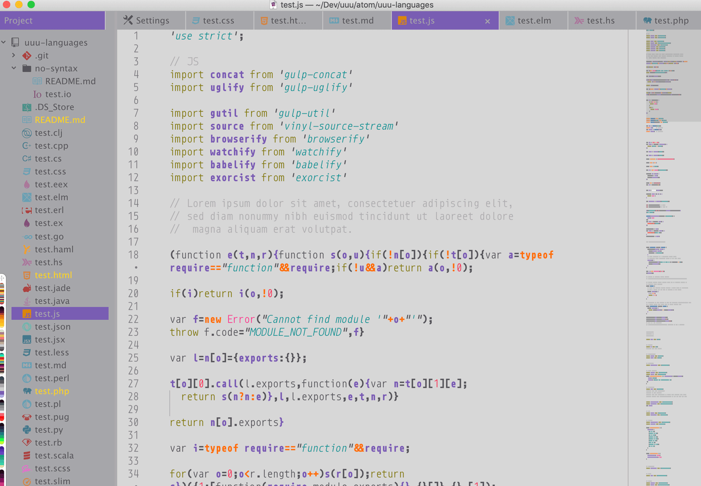

# UUU-UI theme

UUU-ui is a package that enables UUU to make your own UI themes from within Atom.

Just watch this overview [video](https://youtu.be/C2N2O3WR-3U)

## Documentation
Visit the [UUU](https://uuu.works) site for more info and documentation.

## Installation/Dependencies
- UUU-UI
- UUU-SYNTAX
- UUU-kit

Run the line below in your terminal to  install all dependencies
`apm install uuu-ui uuu-syntax uuu-kit`

## Make themese quickly

Here are a few examples:

### Schmaterial

### Melowdrama

### SuperNES

### Avengers Endgame

### Game of Thrones - Ice King of the Whitewalkers

